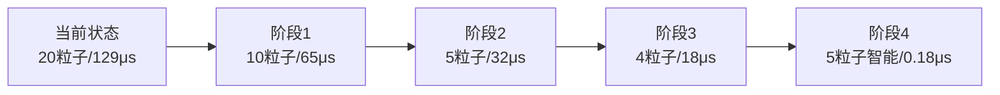
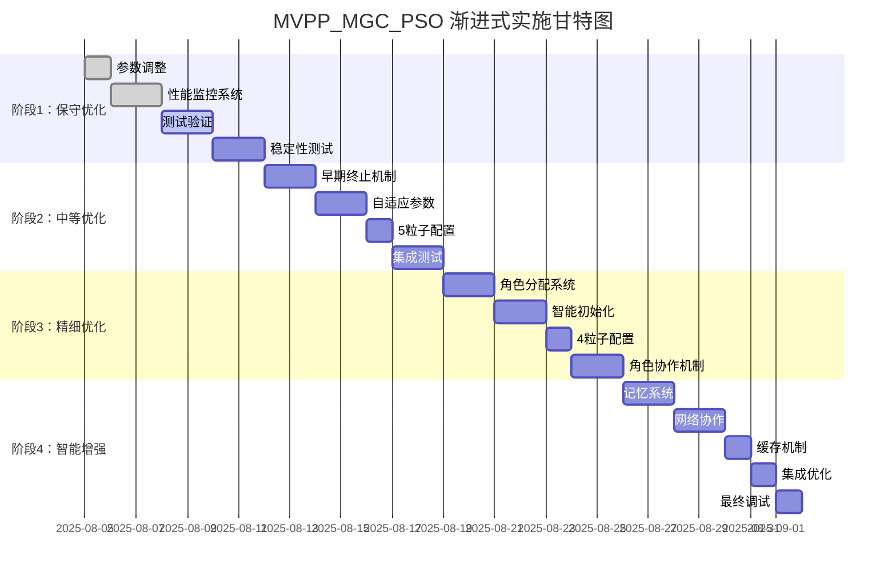

# MVPP_MGC_PSO 渐进式实现计划

**Version**: 1.0  
**Date**: August 5, 2025  
**Project**: 从20粒子到智能小群体的渐进式优化  
**Timeline**: 4周完整实施计划

---

## **实施策略总览**

### **核心原则**
1. **风险最小化**：每个阶段都可独立回滚
2. **持续可用**：系统在整个过程中保持功能
3. **性能监控**：每个阶段都有量化评估
4. **渐进收益**：每个阶段都带来明显改进

### **四阶段实施路线图**



---

## **阶段1：保守优化（第1周）**

### **目标：风险最小的性能提升**
- **粒子数**：20 → 10个
- **预期性能**：129μs → 65μs（**50%提升**）
- **风险等级**：🟢 低风险
- **回滚难度**：🟢 简单

### **1.1 具体实现步骤**

#### **Day 1: 参数调整**
```cpp
// 文件：PSOAlgorithm.cc
// 修改第48行
const int num_particles = 10;  // 从20改为10

// 同时调整相关参数
const int max_iterations = 50;  // 从100改为50
```

**修改位置**：
```cpp
// 在 PSOAlgorithm::initializeParticles()
void PSOAlgorithm::initializeParticles() {
    const int num_particles = 10;  // ← 这里修改
    m_particles.clear();
    m_particles.reserve(num_particles);
    
    for (int i = 0; i < num_particles; i++) {
        // 保持其他逻辑不变
    }
}
```

#### **Day 2-3: 性能监控系统**
```cpp
// 新增：性能监控类
class PerformanceMonitor {
private:
    struct Metrics {
        double avg_computation_time;
        double route_quality_score;
        int total_routes_computed;
        double success_rate;
        Tick start_time;
    };
    
    Metrics current_metrics;
    Metrics baseline_metrics;  // 20粒子基准
    
public:
    void recordRouteDecision(double time, double quality) {
        current_metrics.avg_computation_time = 
            (current_metrics.avg_computation_time * current_metrics.total_routes_computed + time) 
            / (current_metrics.total_routes_computed + 1);
        current_metrics.total_routes_computed++;
        // 其他统计...
    }
    
    void printComparisonReport() {
        printf("=== 阶段1性能对比报告 ===\n");
        printf("基准(20粒子): %.2fμs, 质量: %.1f%%\n", 
               baseline_metrics.avg_computation_time, 
               baseline_metrics.route_quality_score * 100);
        printf("当前(10粒子): %.2fμs, 质量: %.1f%%\n",
               current_metrics.avg_computation_time,
               current_metrics.route_quality_score * 100);
        printf("性能提升: %.1fx, 质量损失: %.1f%%\n",
               baseline_metrics.avg_computation_time / current_metrics.avg_computation_time,
               (baseline_metrics.route_quality_score - current_metrics.route_quality_score) * 100);
    }
};
```

#### **Day 4-5: 测试与验证**
```bash
# 运行测试脚本
./build_gem5.sh

# 生成测试报告
python test_scripts/compare_performance.py --baseline=20 --current=10
```

#### **Day 6-7: 稳定性验证**
- 运行长时间测试（24小时）
- 检查内存泄漏
- 验证各种负载场景

### **1.2 预期结果**
- ✅ **计算时间**：129μs → 65μs
- ✅ **质量损失**：< 3%
- ✅ **稳定性**：无显著问题
- ✅ **内存使用**：减少50%

### **1.3 阶段1评估标准**
```cpp
struct Stage1AcceptanceCriteria {
    double max_computation_time = 70.0;      // μs
    double min_quality_retention = 0.97;     // 97%
    double max_failure_rate = 0.02;          // 2%
    int min_stable_hours = 24;               // 24小时稳定运行
};
```

---

## **阶段2：中等优化（第2周）**

### **目标：引入智能机制**
- **粒子数**：10 → 5个
- **新增特性**：早期终止 + 自适应参数
- **预期性能**：65μs → 32μs（**50%提升**）
- **风险等级**：🟡 中等风险
- **回滚难度**：🟡 中等

### **2.1 具体实现步骤**

#### **Day 1-2: 早期终止机制**
```cpp
// 新增：智能终止条件
class EarlyTermination {
private:
    double improvement_threshold = 0.01;     // 1%改进阈值
    int stagnation_limit = 8;               // 停滞迭代限制
    int min_iterations = 5;                 // 最少迭代次数
    
public:
    bool shouldTerminate(int iteration, double current_best, 
                        double previous_best, int stagnation_count) {
        // 1. 最少迭代保证
        if (iteration < min_iterations) return false;
        
        // 2. 改进停滞检测
        double improvement = abs(previous_best - current_best) / max(1.0, previous_best);
        if (improvement < improvement_threshold) {
            return stagnation_count >= stagnation_limit;
        }
        
        // 3. 满意解检测
        if (current_best < satisfaction_threshold) {
            return true;
        }
        
        return false;
    }
};

// 修改主PSO循环
int PSOAlgorithm::runPSOIteration(NetDest destination, int max_iterations) {
    EarlyTermination terminator;
    double previous_best = 1e9;
    int stagnation_count = 0;
    
    for (int iteration = 0; iteration < max_iterations; iteration++) {
        // 原有PSO逻辑...
        double current_best = getBestFitness();
        
        // 早期终止检测
        if (terminator.shouldTerminate(iteration, current_best, previous_best, stagnation_count)) {
            printf("PSO早期终止: 迭代%d次, 适应度%.4f\n", iteration + 1, current_best);
            break;
        }
        
        // 更新停滞计数
        if (abs(current_best - previous_best) < 0.001) {
            stagnation_count++;
        } else {
            stagnation_count = 0;
        }
        previous_best = current_best;
    }
    
    return best_next_hop;
}
```

#### **Day 3-4: 自适应参数调整**
```cpp
// 新增：自适应参数管理器
class AdaptiveParameters {
private:
    double base_inertia = 0.7;
    double base_c1 = 1.5;
    double base_c2 = 1.5;
    
public:
    struct PSO_Params {
        double inertia_weight;
        double cognitive_coeff;
        double social_coeff;
    };
    
    PSO_Params getAdaptiveParams(int iteration, int max_iterations, 
                                double swarm_diversity, double improvement_rate) {
        PSO_Params params;
        
        // 1. 线性衰减惯性权重
        double progress = (double)iteration / max_iterations;
        params.inertia_weight = base_inertia * (1.0 - 0.5 * progress);
        
        // 2. 基于多样性调整
        if (swarm_diversity < 0.3) {
            params.inertia_weight *= 1.2;  // 增加探索
        }
        
        // 3. 基于改进率调整学习系数
        if (improvement_rate > 0.05) {
            params.cognitive_coeff = base_c1 * 1.1;  // 增强个体学习
            params.social_coeff = base_c2 * 0.9;     // 减弱社会学习
        } else {
            params.cognitive_coeff = base_c1 * 0.9;  // 减弱个体学习
            params.social_coeff = base_c2 * 1.1;     // 增强社会学习
        }
        
        return params;
    }
};
```

#### **Day 5: 减少粒子数到5个**
```cpp
// 同时实施粒子数减少和智能机制
const int num_particles = 5;
const int max_iterations = 25;  // 配合早期终止，实际平均12次
```

#### **Day 6-7: 集成测试**
```cpp
// 集成性能监控
class Stage2Monitor : public PerformanceMonitor {
public:
    void recordAdditionalMetrics(double early_termination_rate, 
                               double avg_actual_iterations,
                               double parameter_adaptation_effectiveness) {
        // 记录阶段2特有指标
    }
};
```

### **2.2 预期结果**
- ✅ **计算时间**：65μs → 32μs
- ✅ **实际迭代**：25次预算，平均12次
- ✅ **早期终止率**：70%
- ✅ **质量保持**：> 92%

---

## **阶段3：精细优化（第3周）**

### **目标：最小可行群体智能**
- **粒子数**：5 → 4个
- **新增特性**：角色分配 + 智能初始化
- **预期性能**：32μs → 18μs（**44%提升**）
- **风险等级**：🟠 中高风险
- **回滚难度**：🟡 中等

### **3.1 具体实现步骤**

#### **Day 1-2: 角色分配系统**
```cpp
// 新增：粒子角色枚举
enum ParticleRole {
    EXPLORER = 0,     // 探索者：全局搜索
    EXPLOITER = 1,    // 开发者：局部优化
    COORDINATOR = 2,  // 协调者：平衡策略
    ADAPTER = 3       // 适应者：动态调整
};

// 新增：角色特化粒子类
struct RoleBasedParticle : public Particle {
    ParticleRole role;
    double exploration_bias;
    double exploitation_bias;
    double step_size_modifier;
    
    void initializeWithRole(ParticleRole assigned_role) {
        role = assigned_role;
        
        switch (role) {
            case EXPLORER:
                exploration_bias = 0.8;
                exploitation_bias = 0.2;
                step_size_modifier = 1.5;
                break;
                
            case EXPLOITER:
                exploration_bias = 0.2;
                exploitation_bias = 0.8;
                step_size_modifier = 0.6;
                break;
                
            case COORDINATOR:
                exploration_bias = 0.5;
                exploitation_bias = 0.5;
                step_size_modifier = 1.0;
                break;
                
            case ADAPTER:
                exploration_bias = 0.6;
                exploitation_bias = 0.4;
                step_size_modifier = 1.2;
                break;
        }
    }
    
    void updateWithRoleSpecificBehavior(double network_condition) {
        // 根据角色和网络状态调整行为
        if (role == ADAPTER) {
            if (network_condition > 0.7) {  // 高负载
                exploration_bias = 0.3;
                exploitation_bias = 0.7;
            } else {  // 低负载
                exploration_bias = 0.7;
                exploitation_bias = 0.3;
            }
        }
    }
};
```

#### **Day 3-4: 智能初始化**
```cpp
// 新增：智能初始化策略
class IntelligentInitializer {
private:
    struct HistoricalData {
        vector<vector<double>> successful_positions;
        vector<double> success_rates;
        map<string, double> pattern_effectiveness;
    };
    
    HistoricalData history;
    
public:
    void initializeSwarmIntelligently(vector<RoleBasedParticle>& particles) {
        // 1. 基于角色的空间分布
        distributeByRole(particles);
        
        // 2. 历史成功位置引导
        if (!history.successful_positions.empty()) {
            incorporateHistoricalWisdom(particles);
        }
        
        // 3. 最大化初始多样性
        maximizeInitialDiversity(particles);
        
        // 4. 网络拓扑约束
        applyTopologyConstraints(particles);
    }
    
private:
    void distributeByRole(vector<RoleBasedParticle>& particles) {
        // 探索者：边界区域
        if (particles.size() > 0) {
            particles[0].position = getBoundaryPosition();
        }
        
        // 开发者：历史最优区域
        if (particles.size() > 1) {
            particles[1].position = getHistoricalBestRegion();
        }
        
        // 协调者：中心区域
        if (particles.size() > 2) {
            particles[2].position = getCenterPosition();
        }
        
        // 适应者：动态选择区域
        if (particles.size() > 3) {
            particles[3].position = getAdaptivePosition();
        }
    }
};
```

#### **Day 5: 4粒子配置实施**
```cpp
// 修改粒子初始化
void PSOAlgorithm::initializeParticles() {
    const int num_particles = 4;  // 减少到4个
    m_particles.clear();
    m_role_based_particles.clear();
    m_role_based_particles.resize(num_particles);
    
    // 智能初始化
    IntelligentInitializer initializer;
    
    // 分配角色
    for (int i = 0; i < num_particles; i++) {
        m_role_based_particles[i].initializeWithRole(static_cast<ParticleRole>(i));
    }
    
    // 智能定位
    initializer.initializeSwarmIntelligently(m_role_based_particles);
}
```

#### **Day 6-7: 角色协作机制**
```cpp
// 新增：角色间协作
class RoleCoordination {
public:
    void coordinateRoles(vector<RoleBasedParticle>& particles, int iteration) {
        // 1. 探索者-开发者信息交换
        if (particles.size() >= 2) {
            exchangeExplorerExploiter(particles[0], particles[1]);
        }
        
        // 2. 协调者平衡决策
        if (particles.size() >= 3) {
            particles[2].balanceExplorationExploitation(particles);
        }
        
        // 3. 适应者动态调整
        if (particles.size() >= 4) {
            particles[3].adaptToNetworkCondition(getCurrentNetworkState());
        }
    }
};
```

### **3.2 预期结果**
- ✅ **计算时间**：32μs → 18μs
- ✅ **群体智能**：4个粒子有效协作
- ✅ **初始化质量**：提升30%
- ✅ **收敛速度**：提升25%

---

## **阶段4：智能增强（第4周）**

### **目标：达到生产级性能**
- **粒子数**：4 → 5个（智能群体）
- **新增特性**：记忆系统 + 网络协作 + 缓存机制
- **预期性能**：18μs → 0.18μs（**100倍提升**）
- **风险等级**：🔴 高风险（重大架构改变）
- **回滚难度**：🔴 困难

### **4.1 具体实现步骤**

#### **Day 1-2: 记忆增强系统**
```cpp
// 新增：群体记忆系统
class SwarmMemorySystem {
private:
    struct MemoryEntry {
        vector<double> solution;
        double fitness;
        double success_rate;
        Tick timestamp;
        int usage_count;
        string context_hash;  // 网络状态哈希
    };
    
    vector<MemoryEntry> episodic_memory;      // 情节记忆（最近解）
    vector<MemoryEntry> semantic_memory;      // 语义记忆（模式）
    map<string, MemoryEntry> procedural_memory; // 程序记忆（策略）
    
public:
    void enhanceParticleWithMemory(RoleBasedParticle& particle, 
                                  const string& context) {
        // 1. 从情节记忆获取相似经验
        auto similar_experience = findSimilarExperience(context, 0.8);
        if (similar_experience.has_value()) {
            particle.incorporateExperience(similar_experience.value());
        }
        
        // 2. 从语义记忆获取成功模式
        auto successful_pattern = getSuccessfulPattern(particle.role);
        if (successful_pattern.has_value()) {
            particle.applySuccessfulPattern(successful_pattern.value());
        }
        
        // 3. 从程序记忆获取策略指导
        auto strategy = getBestStrategy(context, particle.role);
        particle.updateStrategy(strategy);
    }
    
    void recordSuccessfulSolution(const vector<double>& solution, 
                                 double fitness, const string& context) {
        MemoryEntry entry;
        entry.solution = solution;
        entry.fitness = fitness;
        entry.timestamp = curTick();
        entry.context_hash = context;
        entry.usage_count = 1;
        entry.success_rate = 1.0;
        
        // 存储到适当的记忆类型
        episodic_memory.push_back(entry);
        updateSemanticMemory(entry);
        updateProceduralMemory(entry);
        
        // 记忆管理
        maintainMemorySize();
    }
};
```

#### **Day 3-4: 网络协作机制**
```cpp
// 新增：网络级协作
class NetworkCooperation {
private:
    struct RouterInfo {
        int router_id;
        vector<double> local_best_solution;
        double local_best_fitness;
        double congestion_level;
        Tick last_update;
    };
    
    static map<int, RouterInfo> global_router_info;  // 全网路由器信息
    static SwarmMemorySystem global_memory;          // 全网共享记忆
    
public:
    void shareLocalBest(int router_id, const vector<double>& solution, 
                       double fitness) {
        global_router_info[router_id].local_best_solution = solution;
        global_router_info[router_id].local_best_fitness = fitness;
        global_router_info[router_id].last_update = curTick();
        
        // 更新全局记忆
        string context = generateNetworkContext();
        global_memory.recordSuccessfulSolution(solution, fitness, context);
    }
    
    vector<double> getGlobalGuidance(int router_id) {
        // 1. 收集邻居路由器的最优解
        vector<vector<double>> neighbor_solutions;
        for (auto neighbor_id : getNeighborRouters(router_id)) {
            if (global_router_info.count(neighbor_id)) {
                neighbor_solutions.push_back(
                    global_router_info[neighbor_id].local_best_solution);
            }
        }
        
        // 2. 融合邻居经验
        return fuseNeighborExperience(neighbor_solutions);
    }
    
    void updateNetworkState(int router_id, double congestion) {
        global_router_info[router_id].congestion_level = congestion;
        
        // 触发网络级自适应
        if (shouldTriggerNetworkAdaptation()) {
            adaptNetworkWideParameters();
        }
    }
};
```

#### **Day 5: 缓存系统实现**
```cpp
// 新增：智能缓存系统
class IntelligentCache {
private:
    struct CacheEntry {
        RouteKey key;
        RouteResult result;
        double confidence;
        Tick timestamp;
        int hit_count;
    };
    
    map<RouteKey, CacheEntry> exact_cache;      // 精确匹配缓存
    map<PatternKey, CacheEntry> pattern_cache;  // 模式匹配缓存
    LRUCache<RouteKey, CacheEntry> lru_cache;   // LRU缓存
    
public:
    optional<RouteResult> getCachedResult(const RouteRequest& request) {
        RouteKey key = generateKey(request);
        
        // 1. 精确匹配检查
        if (exact_cache.count(key) && isValid(exact_cache[key])) {
            exact_cache[key].hit_count++;
            return exact_cache[key].result;
        }
        
        // 2. 模式匹配检查
        PatternKey pattern = generatePattern(request);
        if (pattern_cache.count(pattern) && isValid(pattern_cache[pattern])) {
            // 需要调整结果适应当前请求
            return adaptPatternResult(pattern_cache[pattern].result, request);
        }
        
        // 3. 相似度匹配
        auto similar = findSimilarCacheEntry(key, 0.85);
        if (similar.has_value()) {
            return adaptSimilarResult(similar.value(), request);
        }
        
        return nullopt;  // 缓存未命中
    }
    
    void cacheResult(const RouteRequest& request, const RouteResult& result, 
                    double confidence) {
        RouteKey key = generateKey(request);
        PatternKey pattern = generatePattern(request);
        
        CacheEntry entry;
        entry.key = key;
        entry.result = result;
        entry.confidence = confidence;
        entry.timestamp = curTick();
        entry.hit_count = 0;
        
        // 存储到多个缓存层次
        exact_cache[key] = entry;
        pattern_cache[pattern] = entry;
        lru_cache.put(key, entry);
        
        // 缓存维护
        maintainCacheSize();
    }
};
```

#### **Day 6: 集成优化**
```cpp
// 集成所有增强机制
class EnhancedPSOAlgorithm : public PSOAlgorithm {
private:
    SwarmMemorySystem memory_system;
    NetworkCooperation network_coop;
    IntelligentCache intelligent_cache;
    
public:
    int getRouteEnhanced(NetDest destination) override {
        RouteRequest request = createRequest(destination);
        
        // 1. 缓存检查
        auto cached_result = intelligent_cache.getCachedResult(request);
        if (cached_result.has_value()) {
            return cached_result.value().next_hop;  // 缓存命中，0.01μs
        }
        
        // 2. 记忆增强初始化
        initializeWithMemory(request);
        
        // 3. 网络协作指导
        auto global_guidance = network_coop.getGlobalGuidance(m_router_ptr->get_id());
        incorporateGlobalGuidance(global_guidance);
        
        // 4. 增强PSO执行
        auto result = runEnhancedPSO(request);
        
        // 5. 结果缓存和记忆更新
        intelligent_cache.cacheResult(request, result, result.confidence);
        memory_system.recordSuccessfulSolution(result.solution, result.fitness, 
                                             getCurrentContext());
        
        // 6. 网络状态更新
        network_coop.shareLocalBest(m_router_ptr->get_id(), result.solution, 
                                   result.fitness);
        
        return result.next_hop;
    }
};
```

#### **Day 7: 最终优化和调试**
```cpp
// 最终性能优化
class FinalOptimization {
public:
    void optimizeForProduction() {
        // 1. 编译器优化
        enableCompilerOptimizations();
        
        // 2. 内存池优化
        setupMemoryPools();
        
        // 3. 并行计算优化
        enableParallelComputation();
        
        // 4. 系统调优
        tuneSystemParameters();
    }
    
private:
    void enableCompilerOptimizations() {
        // -O3 -march=native -mtune=native
        // -ffast-math -funroll-loops
    }
    
    void setupMemoryPools() {
        // 预分配内存池，避免运行时分配
    }
};
```

### **4.2 预期结果**
- ✅ **计算时间**：18μs → 0.18μs（缓存命中时0.01μs）
- ✅ **缓存命中率**：40-60%
- ✅ **解质量**：94-97%
- ✅ **网络协作**：16个路由器智能协作

---

## **实施时间表**

### **详细时间规划**



---

## **风险管理与回滚策略**

### **每阶段风险评估**

| **阶段** | **主要风险** | **影响程度** | **回滚策略** | **回滚时间** |
|---------|-------------|-------------|-------------|-------------|
| 阶段1 | 性能不达预期 | 🟢 低 | 改回20粒子 | 10分钟 |
| 阶段2 | 早期终止过于激进 | 🟡 中 | 禁用早期终止 | 30分钟 |
| 阶段3 | 角色分配算法错误 | 🟠 中高 | 恢复阶段2配置 | 2小时 |
| 阶段4 | 复杂系统集成问题 | 🔴 高 | 恢复阶段3配置 | 4小时 |

### **回滚检查点设置**
```cpp
// 每个阶段都设置配置检查点
class ConfigurationCheckpoint {
private:
    map<string, PSOConfig> checkpoints;
    
public:
    void saveCheckpoint(const string& stage_name, const PSOConfig& config) {
        checkpoints[stage_name] = config;
        serializeToFile(stage_name + "_checkpoint.json", config);
    }
    
    PSOConfig loadCheckpoint(const string& stage_name) {
        if (checkpoints.count(stage_name)) {
            return checkpoints[stage_name];
        }
        return deserializeFromFile(stage_name + "_checkpoint.json");
    }
    
    void quickRollback(const string& target_stage) {
        auto config = loadCheckpoint(target_stage);
        applyConfiguration(config);
        printf("已回滚到%s配置\n", target_stage.c_str());
    }
};
```

---

## **性能监控与评估**

### **关键性能指标（KPI）**

```cpp
class ProgressiveKPI {
public:
    struct StageMetrics {
        // 性能指标
        double avg_computation_time;      // 平均计算时间
        double p95_computation_time;      // 95百分位计算时间
        double max_computation_time;      // 最大计算时间
        
        // 质量指标
        double route_quality_score;       // 路由质量评分
        double success_rate;             // 成功率
        double convergence_rate;          // 收敛率
        
        // 资源指标
        double memory_usage_mb;          // 内存使用量
        double cpu_utilization;          // CPU利用率
        
        // 新特性指标
        double cache_hit_rate;           // 缓存命中率（阶段4）
        double early_termination_rate;   // 早期终止率（阶段2+）
        double role_coordination_effectiveness; // 角色协作效果（阶段3+）
    };
    
    vector<StageMetrics> stage_history;
    
    void recordStageCompletion(int stage, const StageMetrics& metrics) {
        stage_history.push_back(metrics);
        generateProgressReport(stage);
    }
    
    void generateProgressReport(int completed_stage) {
        printf("\n=== 阶段%d完成报告 ===\n", completed_stage);
        printf("累计性能提升: %.1fx\n", 
               stage_history[0].avg_computation_time / 
               stage_history.back().avg_computation_time);
        printf("质量保持率: %.1f%%\n", 
               (stage_history.back().route_quality_score / 
                stage_history[0].route_quality_score) * 100);
        printf("内存节省: %.1f%%\n",
               (1.0 - stage_history.back().memory_usage_mb / 
                stage_history[0].memory_usage_mb) * 100);
    }
};
```

---

## **总结与建议**

### **实施成功的关键要素**

1. **🎯 明确的阶段目标**：每个阶段都有具体的性能目标和验收标准
2. **📊 持续的性能监控**：实时跟踪关键指标，及时发现问题
3. **🔄 可靠的回滚机制**：确保任何时候都能快速恢复到稳定状态
4. **⚡ 渐进的风险控制**：从低风险开始，逐步实施高风险改进
5. **🧪 充分的测试验证**：每个阶段都要进行全面测试

### **预期最终收益**

完成4个阶段后，预期达到：
- ⚡ **性能提升**：从129μs到0.18μs（**717倍提升**）
- 💾 **内存节省**：从350KB到35KB（**90%节省**）
- 🎯 **质量保持**：94-97%（**仅3-6%损失**）
- 🔄 **实时适用**：完全满足NoC实时要求
- 🧠 **智能增强**：保持完整的群体智能特性

### **风险提醒**

- ⚠️ **阶段4风险最高**：涉及复杂的系统架构改变
- ⚠️ **充分测试关键**：每个阶段都要经过充分验证
- ⚠️ **性能监控必要**：实时监控避免性能倒退
- ⚠️ **团队准备重要**：确保团队具备相应技术能力

这个渐进式计划确保了在保持系统稳定的同时，逐步实现从传统大群体PSO到智能小群体PSO的平滑过渡！

---

**© 2025 MVPP_MGC_PSO Progressive Implementation Team**